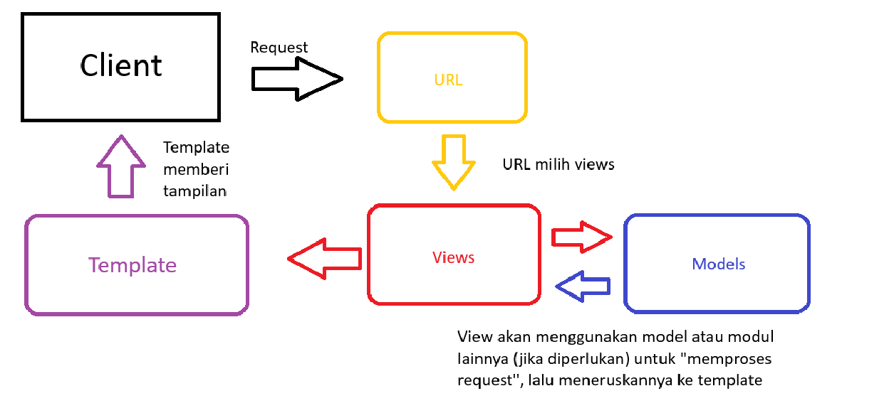
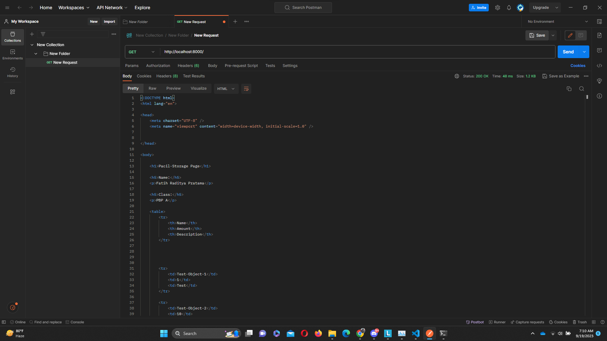
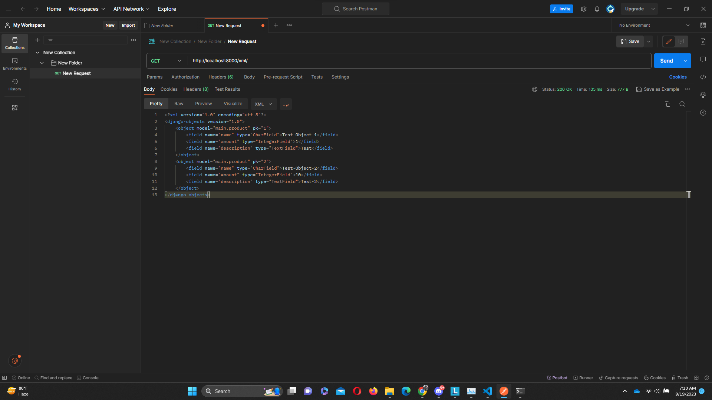
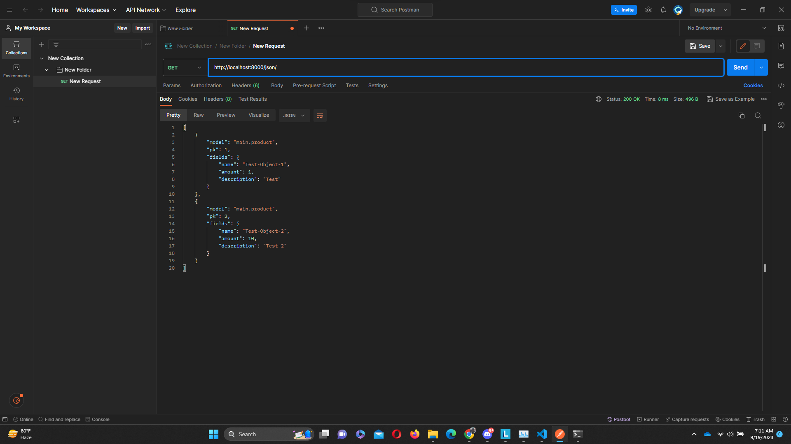
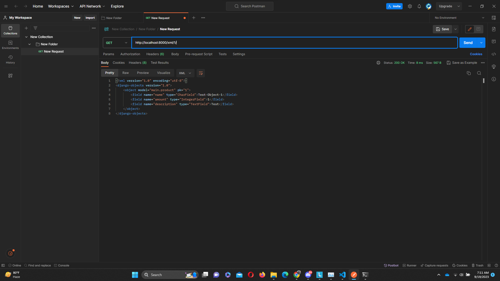
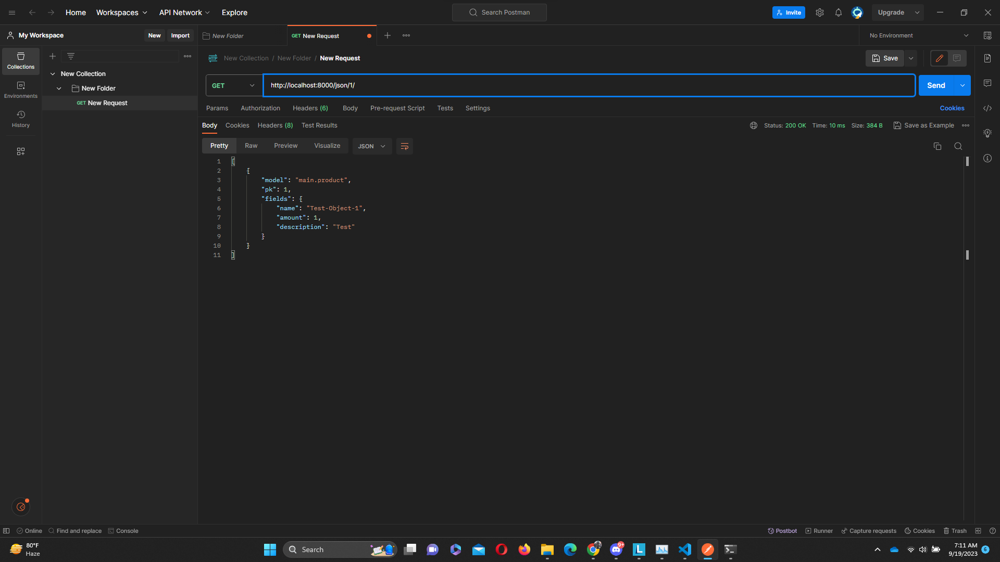

Nama    : Fatih Raditya Pratama

NPM     : 2206083520

Kelas   : PBP A
<details>
<summary>TUGAS-2</summary>
1.  
Membuat proyek baru di Django:  

-pertama bikin directory baru  

-nyalakan virtual environment di directory dan masukkan requirements.txt yang berisi
requirements yang dibutuhkan  

-install semua lewat pip install  

-menjalankan command "python manage.py startapp ('app name')"di directory  

-tambahkan 'app name'(disini namanya 'main') di installed_apps dalam settings.py direktori project  

-Setelah itu kita akan mmebuat directory templates dalam directory 'main' dan akan menambahkan
main.html ke dalamnya  

-Untuk membuat models, kita bisa melakukan:  
```python
class Product(models.Model):
    name = models.CharField(max_length=255)
    amount = models.IntegerField()
    description = models.TextField()
```


untuk name, amount, dan description, pakai field yang sesuai, untuk
models.Model adalah kelas dasar yang digunakan untuk mendefinisikan model dalam Django.
Tidak lupa setelah ini kita perlu migrasi model data ini  untuk mengubah struktur tabel basis data 
sesuai dengan perubahan model yang didefinisikan dalam kode, kita bisa melakukan migrasi dengan cara:

python manage.py makemigrations ---> makemigrations menciptakan berkas migrasi yang berisi perubahan model yang belum diaplikasikan ke dalam basis data

diikuti dengan

python manage.py migrate ---> migrate mengaplikasikan perubahan model yang ada di basis data

-Setelah pembuatan model dan migrasi model selesai, kita bisa membuat function di views untuk di return ke html kita dengan cara:

def show_main(request):
    context = {
        'name': 'Fatih Raditya Pratama',
        'class': 'PBP A',
    }

    return render(request, "main.html", context)

-Kita bisa melakukan routing ke main.html dengan cara:

from django.urls import path, include
from main.views import show_main

app_name = 'main'

urlpatterns = [
    path('', show_main, name='show_main'),
    path('main/',include('main.urls'))
]

path 'main/' akan mengarahkan ke urls.py di directory main

-Setelah semua ini selesai, kita tinggal commit dan push ke repository github dan hubungkan ke adaptable

2.


-Jadi, saat client melakukan request, dan jika valid diterima oleh web server, dan
diturunkan ke Django
-Django menentukan URL
-URL akan menentukan view mana yang dipilih
-view akan mengambil model
-models tersebut digunakan view untuk diteruskan ke template(html)
-template(html) diteruskan dan ditampilkan ke pengguna

3.
Venv(Virtual Environment), berguna untuk menjalankan project dengan dependencies yang berbeda-beda dalam
satu sistem operasi yang sama.


4. 
Perbedaan MVC, MVT, dan MVVM
-MVC(Model-View-Controller)
-MVT(Model-View-Template)
-MVVM(Model-View-Viewmodel)
Pada ketiga ini, model dan view itu sama, model untuk mengelola data aplikasi dan
view adalah bagian yang mengatur bagaimana data dari model ditampilkan ke user.

-Pada MVC, Controller bertanggung jawab untuk menerima input dari user dan mengupdate
view dan model
-Pada MVT, Template bertanggung jawab untuk menampilkan hasil kepada user (biasanya html)
-Pada MVVM, ViewModel bertanggung jawab untuk menghubungkan view dan model, jadi kayak
semacam gabungan antara view dan model

P.S
Selain 2 tes di tests.py saya menambahkan satu test lagi
</details>


TUGAS-3


1.
Perbedaan form POST dan form GET pada Django:

POST
Metode POST mengirimkan data sebagai bagian dari permintaan HTTP, yang tidak terlihat di URL

GET
Metode GET bundling data menjadi string yang nantinya akan ditampilkan pada URL.

Sumber:
https://docs.djangoproject.com/en/4.2/topics/forms/#:~:text=GET%20and%20POST%20are%20typically,the%20state%20of%20the%20system.

2.
HTML vs XML vs Json

HTML: HTML memiliki elemen khusus dan atribut yang digunakan untuk menentukan struktur dan tampilan konten web, jadi biasanya digunakan untuk halaman web

XML: Dokumen XML membentuk struktur seperti tree yang dimulai dari root, lalu branch, hingga berakhir pada leaves. Dokumen XML harus mengandung sebuah root element yang merupakan parent dari elemen lainnya. XML memungkinkan penggunaan karakteristik khusus dan definisi dari dokumen karena XML didesain menjadi self-descriptive, kita bisa paham apa yang ada di XML dengan membaca XML nya.

Json: Json didesain menjadi self-describing sehingga kita sebagai manusia yang melihatnya akan langsung paham karena sangat mudah untuk dimengerti. Json digunakan untuk pertukaran data ringan antar server dan klien di aplikasi web

3.
Kenapa Json sering digunakan?

Karena Seperti yang dijelaskan di nomor-2. Json itu didesain sebagai sebuah self-describing markup language, sehingga akan sangat mudah dipahami dan orang yang membacanya tidak akan terlalu bingung. Selain mudah dibaca, Json juga lebih ringkas dan terintegrasi dengan javascript(JS) sehingga akan lebih memudahkan penggunanya.

4.
-Making Forms

Untuk membuat forms pertama kita buat file forms.py di main aplikasi, kita bisa menggunakan
ModelForm dari Django dan import Product dari models yang ada di main, setelah itu, kita bisa
assign model=Product untuk menyimpan objek yang dibuat di form menjadi objek Product. Setelah itu
kita akan menambahkan fields yang telah kita buat di models yaitu name,price, dan description.

Setelah membuat forms.py kita bisa menambahkan method create_product di views untuk menambahkan
product yang kita buat di form ketika kita submit form-nya. kita declare form = ProductForm(request.POST or None) 
untuk membuat ProductForm berdasarkan input user di request.POST. Setelah itu, kita bisa cek apakah form nya
sudah valid atau belum dan kita simpan. Kita juga bisa gunakan HTTPResponseRedirect untuk redirect setelah data form
berhasil di simpan. 

Setelah itu, kita bisa menambahkan products nya di fungsi show_main yang ada di views untuk menampilkannya. Dan juga
kita harus menambahkan fungsi create_product di urls.py dan menambahkan path untuk menuju halaman form pembuatan product.
Setelah itu barulah kita buat halaman html nya.

2&3.
-Menambahkan fungsi di views untuk Show HTML, XML, JSON, XML by ID, dan JSON by ID
-Menambahkan routing

-HTML: 
fungsi untuk show HTML sudah ada dari tugas sebelumnya yaitu show_main yang akan menggunakan fungsi render untuk mengambil 3
argumen yaitu context, request, dan main.html yang nantinya akan di render di satu main.html

-XML: 
Untuk mengembalikan data dalam bentuk XML kita bisa menggunakan serializer dan HTTPResponse, serializer digunakan untuk
mengubah/transalasi objek menjadi XML, lalu kita akan membuat fungsi show_xml yang akan return HTTPResponse untuk menampilkan
objek dalam bentuk xml

return HttpResponse(serializers.serialize("xml", data), content_type="application/xml")

HTTPResponse berguna untuk mengembalikan menjadi laman yang bisa dilihat, setelah ini tidak lupa kita akan menambahkan path di
urls.py untuk menampilkan laman dalam fomat xml

path('xml/', show_xml, name='show_xml'),

-JSON: 
Untuk JSon juga sama, menggunakan serializer dan HTTPResponse dan tidak lupa menambahkan path di urls.py untuk show dalam format
json, bentuk return dan path nya hanya tinggal diganti dengan json

return HttpResponse(serializers.serialize("json", data), content_type="application/json")

path('json/', show_json, name='show_json'),

-XML & Json by ID: 
Sekarang untuk return data berdasarkan ID dalam XML dan Json kita bisa menambahkan variabel baru seperti ini.

data = Product.objects.filter(pk=id)

Yang akan menyimpan hasil query dari data dengan id tertentu. Setelah itu barulah kita return seperti biasa
menggunakan HTTPResponse dan juga serializer, xml untuk format xml dan json untuk format json(sama seperti sebelum-sebelumnya). Tidak lupa kita akan menambahkan routing di urls.py, sama seperti sebelumnya:

path('xml/<int:id>/', show_xml_by_id, name='show_xml_by_id'),

path('json/<int:id>/', show_json_by_id, name='show_json_by_id'),

Seperti di atas.

Screenshot Postman







Function untuk show jumlah barang yang ada:

Kita bisa import fungsi sum yang ada dari library django dan aggregate, fungsi sum berguna untuk
menjumlahkan numericalField, integer, float, dsb. Aggregate sendiri adalah method yang diperlukan
jika ingin menggunakan fungsi-fungsi seperti Sum, Avg, Count, Max, Min, dll. Ini semua karena
Sum, Avg, Count, Max, Min, dll itu adalah bagian dari aggregate functions yang membutuhkan aggregate
method. Berikut adalah code nya:

def show_main(request):
    ...
    total_amount = products.aggregate(Sum('amount'))['amount__sum']

    context = {
        ....
        'totalAmount': total_amount,
    }

    return render(request, "main.html", context)